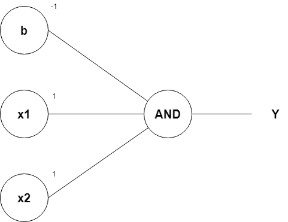
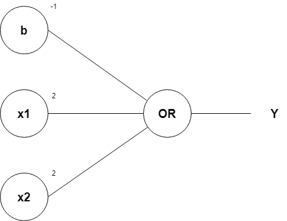
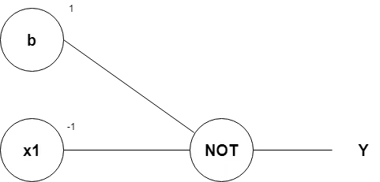

# What is a perceptron?

Perceptron is considered a single-layer neural link with four main parameters. The perceptron model begins with multiplying all input values and their
weights, then adds these values to create the weighted sum. Further, this weighted sum is applied to the activation function ‘f’ to obtain the desired
output.
Single Layer Perceptron model consists of a feed-forward network and includes a threshold transfer inside the model. The main objective of the single-layer perceptron model is to analyze the linearly separable objects with binary outcomes. A Single-layer perceptron can learn only linearly separable patterns.

# List the activation function used in perceptron and the differences between them?

## Binary Step function

Binary step function depends on a threshold value that decides whether a neuron should be activated or not. 
The input fed to the activation function is compared to a certain threshold; if the input is greater than it, then the neuron is activated, else it is deactivated, meaning that its output is not passed on to the next hidden layer.

$$
    f(x) = \begin{cases}
        0 & \text{for } x < 0 \\
        1 & \text{for } x \ge 0
    \end{cases}
$$

## Linear Activation Function

The linear activation function, also known as "no activation," or "identity function" (multiplied x1.0), is where the activation is proportional to the input.
The function doesn't do anything to the weighted sum of the input, it simply spits out the value it was given

$$
    f(x) = x
$$

## Sigmoid Activation function

This function takes any real value as input and outputs values in the range of 0 to 1. 
The larger the input (more positive), the closer the output value will be to 1.0, whereas the smaller the input (more negative), the closer the output will be to 0.0

$$
    f(x) = \frac{1}{1 + e^{-x}}
$$

## $\tanh$ (hyperbolic tangent function)

$\tanh$ function is very similar to the sigmoid/logistic activation function, and even has the same S-shape with the difference in output range of -1 to 1. In Tanh, the larger the input (more positive), the closer the output value will be to 1.0, whereas the smaller the input (more negative), the closer the output will be to -1.0.

$$
    f(x) = \frac{e^x - e^{-x}}{e^x + e^{-x}}
$$

## ReLU Function
ReLU stands for Rectified Linear Unit. 

Although it gives an impression of a linear function, ReLU has a derivative function and allows for back-propagation while simultaneously making it computationally efficient. 

The main catch here is that the ReLU function does not activate all the neurons at the same time. 

The neurons will only be deactivated if the output of the linear transformation is less than 0.

$$
    f(x) = max(0,x)
$$

## Leaky ReLU Function

Leaky ReLU is an improved version of ReLU function to solve the Dying ReLU problem as it has a small positive slope in the negative area.

$$
    f(x) = max (0.1x,x)
$$

The advantages of Leaky ReLU are same as that of ReLU, in addition to the fact that it does enable back-propagation, even for negative input values. 

## Parametric ReLU Function

Parametric ReLU is another variant of ReLU that aims to solve the problem of gradient’s becoming zero for the left half of the axis. 

This function provides the slope of the negative part of the function as an argument $a$. By performing back-propagation, the most appropriate value of $a$ is learnt.

$$
    f(x) = max(ax,x)
$$

Where "$a$" is the slope parameter for negative values.

## Exponential Linear Units (ELUs) Function

Exponential Linear Unit, or ELU for short, is also a variant of ReLU that modifies the slope of the negative part of the function. 

ELU uses a log curve to define the negative values unlike the leaky ReLU and Parametric ReLU functions with a straight line.

$$
    f(x) = \begin{cases}
        x & \text{for } x \ge 0 \\
        \alpha  (e^x - 1) & \text{for } x < 0
    \end{cases}
$$

# How is the output of a perceptron computed?

The perceptron model begins with multiplying all input values and their weights, then adds these values to create the weighted sum. Further, this weighted sum is applied to the activation function '$f$' to obtain the desired output.

# What is the role of a loss function in the training of a perceptron?

Loss or cost function (or sometimes called error function) is a function that maps an event or values of one or more variables onto a real number.
In simpler terms, the loss function is a method of evaluating how well the perceptron is functioning.

# Define mean squared error (MSE) loss function.

It is a risk function corresponding to the expected value of the squared error loss. Mean square error is calculated by taking the average, specifically the mean, of errors squared from data as it relates to a function.

$$
    MSE = \frac{1}{n} \sum^{n}_{i=1} (Y_i - \hat{Y_i})^2
$$

# How can you adjust the weights of a perceptron during training ?

After computing the error we can update the weight by adding the old weight and the error multiplied by the input of the perceptron

$$
W_i` = W_i + \alpha \times \text{ error } \times X_i
$$

# Why do we apply sign() function on the pereceptron output?

The neural networks that use monotonic function, which are mapping of the output of $Z$ between -1 and 1, such $sign()$ function reduce the number of adjustments that the network would do, in return the training times of the networks would decreases significantly reducing the cost of training of neural network models

# What is the use of Bias ?

Bias can be defined as the constant which is added to the product of features and weights, used to off-set the result and help the model to shift the activation function towards the positive or negative side accordingly.

# How to update Bias ?

We can update the bias in the same manner we updated the weight of the perceptron.

$$
    bias_{new} = bias_{old} + \alpha \times error 
$$
where $\alpha$ represents the learning rate, if the learning rate is 1 then it can be discarded and the new equation will be

$$
    bias_{new} = bias_{old} + error
$$

# Design one layer perceptron to represent the following logic functions

## AND gate

$$
    x_1 + x_2 - 1
$$

## Or Gate

$$
2x_1 + 2x_2 -1
$$

## NOT

$$
-x_1 -1
$$

